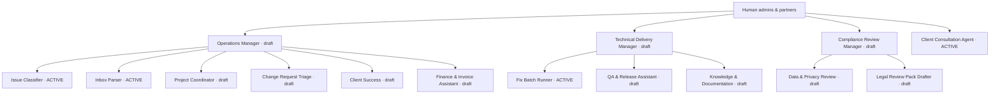

# AI Workspace — Administration Guide (Phase 1)

The AI Workspace is the agency's visual AI office: `/admin/ai` (staff-only; same auth
gate + MFA step-up as the rest of the Ops Hub, RLS-enforced server-side).

## Implemented hierarchy (as seeded)

**Execution flow today (Phase 1):** the four ACTIVE agents describe automation that
already runs in production (consultation pipeline, issue classification, inbox
ingest, fix-batch Managed Agents sessions). Their runs land in `agent_runs`
(usage, cost, duration, errors) and surface in the Workspace. Draft agents cannot
see data, call tools or accept tasks. Manager delegation, approvals and the
runtime adapter arrive in Phases 2–4.

## How to…

- **See the office at a glance** — `/admin/ai`: active/draft counts, open tasks,
  work awaiting a human, failures, stale agents, spend (today/30 days), runtime
  health (honest config-presence, no fake heartbeats), activity feed.
- **Read the reporting lines** — `/admin/ai/map`. Humans at top; managers carry a
  `MANAGER` tag; children hang off a solid connector. Each node shows lifecycle,
  open tasks, waiting approvals and last activity (with an explicit STALE flag
  after 24h of silence). `/admin/ai/agents` is the accessible table equivalent.
- **Inspect an agent** — click any node/row: role, manager, accountable human,
  runtime, max risk tier, capabilities, tool grants, data scopes, human gates,
  recent tasks/runs/ledger, and versioned config history.
- **Pause / resume / archive an agent** — buttons on the profile. Transitions are
  restricted (e.g. a draft can only go to review; only test-mode agents can be
  activated), audited to `audit_log`, and appended to the ledger. Archived agents
  keep history but can never run; there is no delete.
- **Delegate a task** — `/admin/ai/tasks`: objective, agent (active/test only),
  optional client scope, priority, risk tier (capped at Tier 2 in the form and at
  the agent's own limit server-side), execution mode (draft-only / approval-first /
  approved-low-risk). The delegation is recorded, appears on the board, the
  agent's profile and the ledger.
- **Resolve a task** — task detail page: legal human transitions only (e.g. a
  queued task can be completed with a note, blocked, or cancelled). Every change
  writes the trail.
- **Inspect an incident** — failed runs appear on the overview ("Needs a human")
  and the agent profile with the error, cost and duration. Stale active agents are
  flagged rather than shown as live.

## What Phase 1 deliberately does not do

- No autonomous execution paths were added; active agents = existing production
  behaviour, now visible and recorded.
- No approvals inbox yet (Phase 2), no Agent Studio (Phase 3), no runtime
  adapter/heartbeats/routines (Phase 4), no ops automations (Phase 5).
- Role tiers (Workspace Admin / Supervisor / Operator / Observer) await the
  org-wide role split — today every internal staff member has full Workspace
  visibility, and that is stated honestly in the audit.

## Configuration decisions needed (carried from the audit)

Owners per agent · role split · budgets · approved runtimes · Agent Studio test
datasets · `ANTHROPIC_WORKSPACE_SLUG` in env config.
